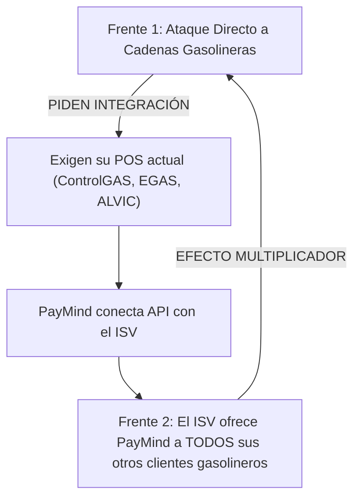

# 🚀 ESTRATEGIA DE CRECIMIENTO EN DOS FRENTES: PAYMIND GROWTH ENGINE

> **Objetivo Comercial:** Dominar el ecosistema de estaciones de servicio en México mediante un ataque simultáneo a **Clientes Directos (Cadenas Gasolineras)** y **Canales de Distribución (Proveedores de Tecnología AMPES & Fabricantes de Quioscos)**.

---

## ⚔️ FRENTE 1: CADENAS GASOLINERAS RETAIL (DEMANDA DIRECTA)

### 🎯 Clientes Objetivo (ICP)
* Cadenas de estaciones de servicio con islas de despacho y tiendas de conveniencia.
* **Leads Verificados en Base de Datos:** RendiChicas (Rendilitros), Petro-7 (7-Eleven Gasolineras), Grupo Gasored, Grupo Petrolero Arca, Grupo Ramca, Ágil Gasolineras, Sujuxi, ATH Organización, Grupo Pinos Altos.

### 💡 Propuesta de Valor (Speed to Lead & Speed to Sell)
1. **Reducción de Mermas y Robos de Efectivo:** El dinero ingresa directamente al quiosco de autocobro blindado o se procesa con tarjeta en isla sin manipulación del despachador.
2. **Speed to Sell (Despacho 3x más Rápido):** Reducción de filas en bombas hora pico mediante cobro con Contactless / SmartPOS / QR.
3. **Conciliación Automatizada Anexo 30 SAT:** Cada transacción se timbra y vincula al control volumétrico sin errores de facturación.

### 📄 Dataset de Ejecución:
* File: `data/LEADS_CADENAS_GASOLINERAS_QUIOSCOS_PAYMIND.csv`

---

## 🤝 FRENTE 2: PROVEEDORES AMPES E ISVs (CANAL DE DISTRIBUCIÓN Y ALIANZAS)

### 🎯 Aliados Objetivo (ISVs & Hardware Partners)
* **Desarrolladores de POS & Control Volumétrico:** ATIO Group (ControlGAS), EGAS, ALVIC, iGAS, Gas Manager, Avalon, Luqross, Enercon/FuelSoft, PRE (Gaspre).
* **Fabricantes de Quioscos y Manejo de Efectivo:** INTERLOGIC, SEPROCESA, Sistemas Neumáticos de Envíos (SNE aerocom).

### 💡 Propuesta de Valor para el Proveedor
1. **Monetización por Volumen (Revenue Share):** Compartir un porcentaje de la tasa de adquirencia/procesamiento de PayMind por cada transacción procesada en sus quioscos o software.
2. **Integración Out-of-the-Box:** PayMind provee las APIs y SDKs de cobro listas para que el software del proveedor entregue una solución llave en mano al gasolinero.
3. **Canal Co-Marketing:** Cuando el proveedor (ej. INTERLOGIC o ATIO) cotiza a un grupo gasolinero, incluye la solución de cobro de PayMind de forma nativa.

### 📄 Dataset de Ejecución:
* File: `data/LEADS_SOCIOS_AMPES_2026.csv`

---

## 🔄 EL BUCLE DE CRECIMIENTO (GROWTH LOOP)

---

## 📋 PASOS DE EJECUCIÓN INMEDIATA

1. **Campaña A (Directa a Gasolineras):** Correo y llamada socrática a los decisores de los 10 grupos gasolineros validados.
2. **Campaña B (Partnership a Proveedores AMPES):** Correo de alianza técnica/comercial a Directores Comercial y de Producto en **INTERLOGIC, ATIO, EGAS y ALVIC**.
