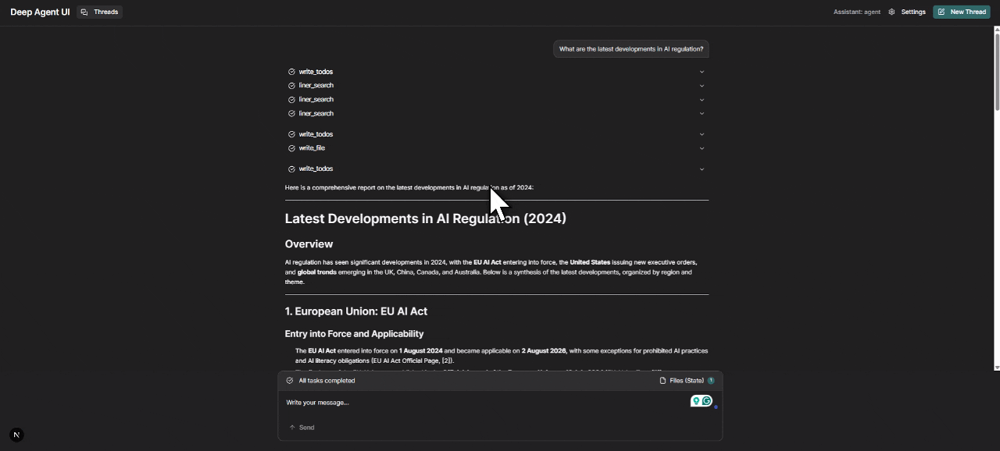

# Deep Research Assistant

An interactive AI research agent that answers any question with a fully cited answer. 
Built on LangChain Deep Agents with the Liner Web Search API as its grounding engine. 
Ask a question and the agent plans its research in real time, calls the Liner Web Search 
API for raw results, synthesizes them into a comprehensive answer where every claim links 
back to a verifiable source, and saves the final report as a downloadable markdown artifact.



## Features

- Real-time task planning with write_todos before every research run
- Grounded answers via Liner Web Search API with titles, URLs, descriptions, and dates
- Every claim in the final answer is backed by a cited source from the search results
- Final report saved to the agent virtual filesystem as a downloadable markdown file
- Full tool call visibility in the Deep Agents UI: plan, search calls, sources, and answer

## Tech Stack

- **Agent Harness:** LangChain Deep Agents
- **Grounding / Search:** Liner Web Search API
- **LLM:** Mistral Small Latest via Mistral API
- **Frontend:** Deep Agents UI (Next.js)

## Why Liner

Liner's Web Search API returns raw, structured results at $1 per 1,000 requests. 
The agent does its own synthesis, so there is no paying twice for answer generation. 
Every result includes a title, URL, description, and date, giving the agent everything 
it needs to produce fully cited answers. Liner is trusted by 13 million users and is 
SOC 2, ISO 27001, and HIPAA compliant.

## Prerequisites

- Python 3.10+
- Node.js 18+ and yarn
- Mistral API key from https://console.mistral.ai
- Liner API key from https://liner.com/developers

## Setup

### 1. Clone the Repository

```bash
git clone https://github.com/Sumanth077/Hands-On-AI-Engineering.git
cd Hands-On-AI-Engineering/ai_agents/deep_research_assistant
```

### 2. Backend Setup

```bash
cd backend
python -m venv .venv
.venv\Scripts\activate
pip install -r requirements.txt
pip install -U "langgraph-cli[inmem]"
copy .env.example .env
```

Open .env and add your Mistral and Liner API keys.

### 3. Start the Backend

```bash
langgraph dev --port 2024
```

### 4. Frontend Setup

```bash
cd ../frontend
yarn install
yarn dev
```

### 5. Open the UI

Open http://localhost:3000, set the server URL to http://localhost:2024, 
and set the assistant ID to agent.

## Usage

Type any research question in the chat input and press Send. The agent will:

1. Plan its research steps using write_todos
2. Call the Liner Web Search API multiple times to gather sources
3. Synthesize a comprehensive cited answer from the results
4. Save the final report as a markdown file to the filesystem

The full run is visible in the UI: plan, tool calls, sources, and final answer. 
The saved report appears under Files (State) and can be downloaded directly.

## Environment Variables

| Variable | Description |
|---|---|
| `MISTRAL_API_KEY` | Your Mistral API key |
| `LINER_API_KEY` | Your Liner Web Search API key |

## Project Structure

```
deep_research_assistant/
├── backend/
│ ├── agent.py
│ ├── liner_tool.py
│ ├── langgraph.json
│ ├── requirements.txt
│ └── .env.example
├── frontend/
│ └── (Deep Agents UI - Next.js)
├── README.md
└── assets/
└── demo.gif
```

## How It Works

1. **Planning** - the agent calls write_todos to break the question into research steps
2. **Searching** - each step calls the Liner Web Search API and receives structured results
3. **Synthesis** - the agent reasons over the results and composes a cited answer
4. **Saving** - the final report is written to the virtual filesystem as a markdown artifact

## Note on Liner APIs

This project uses the Liner Web Search API at $1 per 1,000 requests for raw results, 
letting the agent handle synthesis itself. If you want the entire multi-step research 
pipeline in a single API call, Liner's Deep Research Agent API covers the whole workflow 
out of the box. Docs: https://liner.com/developers/docs/deep-research-agent-api
